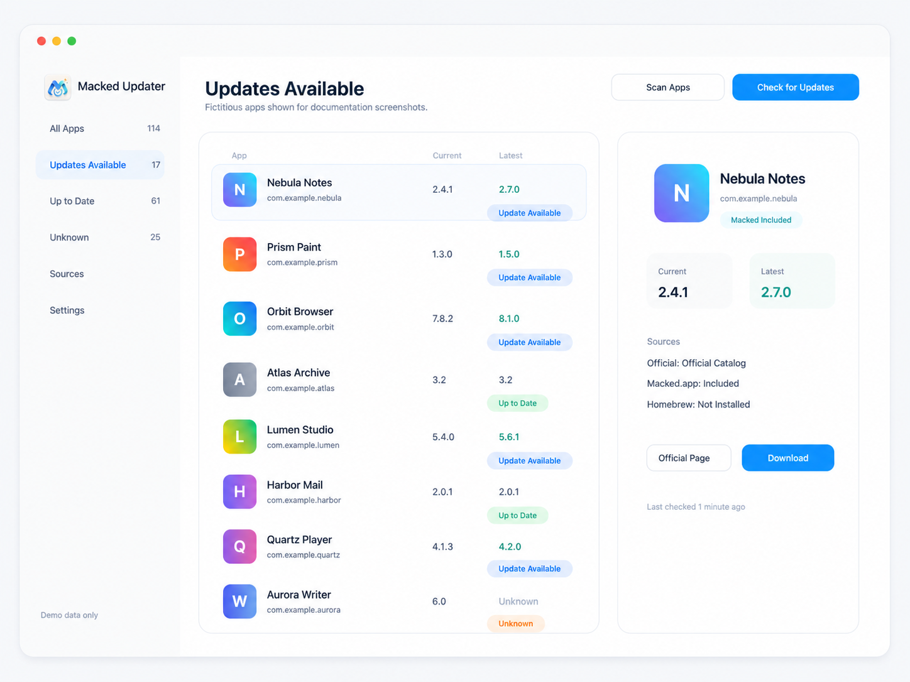
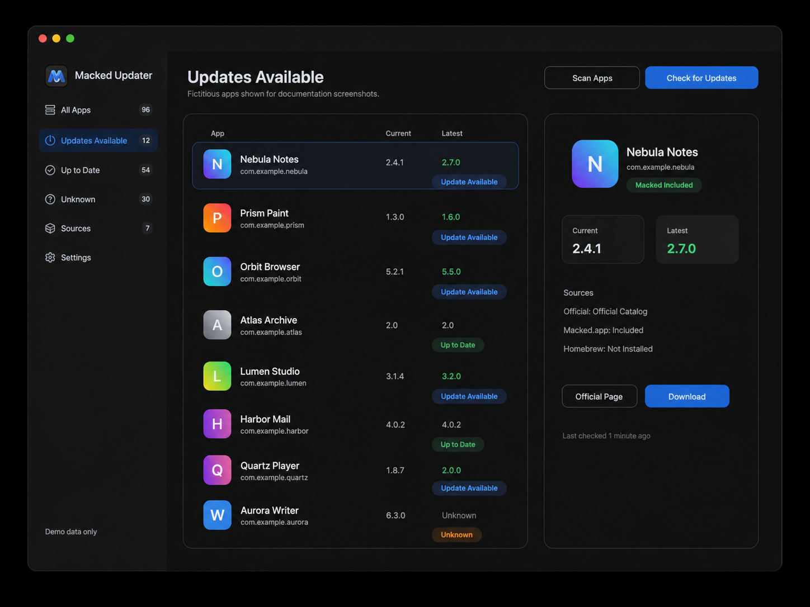

# Macked Updater

[English](README.md) | [简体中文](README.zh-CN.md)

<p align="center">
  
</p>

Macked Updater is a native macOS app for checking installed application versions and aggregating update sources. It scans local `.app` bundles, compares installed versions with available updates, and shows official pages, release notes, and optional authenticated source links in one dashboard.

| Light | Dark |
| --- | --- |
|  |  |

> Screenshots are based on the real app UI and use fictitious app names and bundle identifiers.

## Highlights

- Scan `/Applications`, `~/Applications`, and `/System/Applications`.
- Read app name, bundle identifier, version, build number, install path, modification date, icon, Sparkle feed, and App Store receipt hints.
- Two-step update check:
  1. Fast official-source version check.
  2. Optional Macked.app coverage and download metadata check after login.
- Show current version, latest official version, optional Macked.app version, source name, page links, and download/release-note links.
- Mark matched entries with a `Macked Included` badge.
- Download queue for optional Macked.app downloads with downloaded size, total size, live speed, completion, and failure states.
- Local-only cache. The installed app list is not uploaded to any server.
- Light and dark mode friendly SwiftUI interface.

## Update Sources

Macked Updater currently supports:

- Sparkle appcast (`SUFeedURL` from the app bundle).
- Homebrew Cask (`brew list --cask` and `brew info --cask --json=v2`).
- Mac App Store receipt / lookup metadata.
- GitHub Releases when configured.
- Adobe Help Center release-note pages for common Adobe apps.
- Self-hosted JSON catalogs.
- Macked.app search/detail/download metadata after the user signs in.
- Manual official website search fallback for unknown apps.

## Requirements

- macOS 12 or later.
- Xcode 15+ or Swift 5.9+.
- Optional: Homebrew, if you want Homebrew Cask checks.

## Run from Source

Clone and run:

```bash
git clone https://github.com/<your-name>/macked-updater.git
cd macked-updater
swift run macked-updater
```

Open in Xcode:

```bash
open Package.swift
```

Then run the `macked-updater` executable target.

## Build and Package

Debug app bundle:

```bash
./script/build_and_run.sh --verify
```

Release app and DMG:

```bash
./script/package_release.sh
```

The release script creates:

```text
dist/Macked Updater.app
dist/MackedUpdater-0.1.11.dmg
dist/MackedUpdater.dmg
```

These local builds use ad-hoc signing. For public distribution, sign and notarize with your own Apple Developer identity.

## Self-hosted Catalog Deployment

You can add your own update source by hosting a JSON catalog.

Minimal schema:

```json
{
  "schemaVersion": 1,
  "sourceName": "Example Update Catalog",
  "generatedAt": "2026-07-05T00:00:00Z",
  "apps": [
    {
      "name": "Nebula Notes",
      "bundleIdentifier": "com.example.nebula-notes",
      "latestVersion": "2.7.0",
      "officialPageURL": "https://updates.example.com/apps/nebula-notes",
      "downloadURL": "https://updates.example.com/downloads/nebula-notes-2.7.0.dmg",
      "releaseNotesURL": "https://updates.example.com/apps/nebula-notes/releases/2.7.0"
    }
  ]
}
```

Deployment steps:

1. Edit `deploy/authorized-catalog.json`.
2. Upload it to your own HTTPS static endpoint.
3. Open Macked Updater > Sources.
4. Paste the catalog URL and add matching entries.

Local testing can use a `file://` catalog URL.

## Project Layout

```text
App/            App entry point
Models/         App, update, source, and settings models
Services/       Scanning, update checks, matching, downloads, command helpers
Persistence/    Local JSON cache and user source storage
Views/          SwiftUI screens and shared components
Resources/      macOS app icon resource
assets/         App icon and README screenshots
script/         Build, run, package, and cleanup scripts
deploy/         Example self-hosted catalog
Tests/          XCTest coverage
```

## Development Checks

```bash
swift test
swift build -c release
./script/build_and_run.sh --verify
./script/package_release.sh
```

Clean generated local artifacts while keeping packaged DMGs:

```bash
./script/cleanup_after_run.sh
```

## Privacy

- The app scans local `.app` metadata on your Mac.
- It does not upload your installed app list.
- Macked.app login state is stored in the local WebKit website data store.
- Downloads run only after you click a download button.
- Downloaded files are saved to `~/Downloads`.
- The app does not install, replace, or modify your existing applications.
